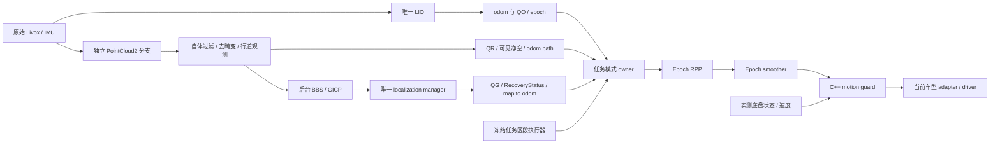

# 温室任务连续导航：代码落地状态

更新：2026-10-03。代码已经加入当前工作区及四个关联仓库，研究运动默认关闭。本文是实际入口与完成范围；此前两份方案中的“建议/尚未实现”保留为设计背景，以本文为准。

## 已落地

| 部分 | 代码与作用 |
| --- | --- |
| 行道感知 | `perception/agt_local_row_perception`：在线和离线共用 C++ core；点时间插值/SLERP 去畸变、重力地面、多高度时序 BEV、双侧共享方向 RANSAC/Huber IRLS、协方差与 QR、保守可见性和停车净空 |
| 车辆遮挡 | box/cylinder 自体和射线遮挡；原字段点云副分支；未知、过期、遮挡没有被当成自由空间；`geometry_from_urdf` 从同一车辆碰撞模型导出感知几何 |
| 质量接口 | typed `LocalRowState/OdomQuality/GlobalQuality`；QO 不把零协方差当可信；odom epoch 随源重置/时间倒退/跳变而变化 |
| 任务与模式 | `runtime/agt_task_continuity`：GLOBAL、DEGRADED、LOCAL_TASK、RECOVERING、SAFE；任务身份、固定局部终点、距离/时间/误差预算、滞回与锁停 |
| 持续任务执行 | `/navigation/execute_task_segment`，外层任务跨内部 map/odom FollowPath；切换先撤权、等待旧 action 终态；终点固定为区段末端，局部预算从 LOCAL 启用开始；校验横向/航向偏差，恢复后重新规划，局部完成不能算地图任务成功 |
| 命令链 | `ResearchFollowPath` 在计算来源生成 typed VelocityCommand；epoch smoother 保留 source stamp；C++ guard 独立核验任务、计划、epoch、质量、净空、底盘真实权限及速度 |
| 非阻塞重定位 | 不可变 query job、后台预处理和 BBS/GICP、整个进程组取消、map/raw-PCD hash/epoch/reference time/期限检查，旧结果不应用 |
| 平滑恢复 | manager 唯一 `map->odom`；至少两次独立一致候选；SE(3) 插值并限制车辆当前位置变化；收敛后用新的 shadow 匹配验证，同 job 的 typed RecoveryStatus 才确认恢复 |
| 多履带底盘 | 保留 Bunker 基线；通用 SI Twist adapter、真实状态映射、YHS 显式协议桥与自研 driver 注册；按车辆 profile 选择 TF 与 Nav2，未标定模板不能运行 |
| 任务层 | sibling `agt_mission` 可选冻结区段派发、取消终态屏障、研究实测停止门；原 V1 RViz/巡检入口继续保留 |
| 实验工具 | 冻结/核验资产与软件、人工核验稳定结构 PCD、bag 点时间导出、session 记录、C0–C5 隔离故障输入、所有尝试的 run 统计及 Wilson 完成率区间 |



研究 local costmap 在 `odom` 中滚动，保留实时障碍。该组合不启动标准 BT navigator、behavior command producers 或标准 velocity smoother。裸 Nav2 Twist 输出连接到隔离话题；只有带来源和 epoch 的链路接到底盘。

## 当前可用入口

构建所有新增和修改包时使用正常 workspace `colcon build`，先 source Humble。本文的编译检查禁用了测试；不等同回放或实车验收。临时编译目录在 `/tmp/agt_greenhouse_20261003`，不会修改已有 install。

已有雷达、单一 LIO 和本车 robot_state_publisher 时，启动观测：

```bash
ros2 launch agt_system_bringup greenhouse_research.launch.py
```

默认 `enable_motion=false`、`start_localization=false`、`start_lio=false`。它只增加 row、QO 与模式观测，不建立另一套 formal localization。传入 `experiment_manifest` 可增加隔离 shadow tracker；未标定质量会保持 invalid 并输出诊断。

离线运行实际命令见 [行道包 README](../../perception/agt_local_row_perception/README.md)。典型流程：

```bash
ros2 run agt_research_tools export_row_bag /absolute/bag \
  --dataset-role D_H --base-frame base_link --output /absolute/new_export

ros2 run agt_local_row_perception local_row_offline \
  --config /absolute/row.yaml --geometry /absolute/geometry.yaml \
  --extrinsics /absolute/extrinsics.yaml \
  --scans /absolute/new_export/scans.csv --poses /absolute/new_export/poses.csv \
  --output /absolute/new_row_run
```

DH 的载体 frame、地面高度和外参必须按手持采集设置，不能照用车辆值。没有可信短时轨迹不能声称完成运动去畸变/时序实验。输出包括逐帧 CSV、centerline、SVG 叠加与 manifest；现有输出不会被覆盖。

冻结配置从 `tools/research/agt_research_tools/config/experiment.example.yaml` 复制填写：

```bash
ros2 run agt_research_tools freeze_experiment \
  --spec /absolute/experiment.yaml --output /absolute/experiments/M0/manifest.yaml
ros2 run agt_research_tools verify_experiment /absolute/experiments/M0/manifest.yaml
```

`geometry_map` 是实际匹配 PCD；`map_hash` 是它的原始 SHA256。`navigation_map` 必须是包括选定 YAML 和 PGM/PNG 的目录，`navigation_map_yaml` 明确指定其中一个 YAML，image 不能越出冻结目录。还必须冻结匹配资产、稳定结构、corridors、routes、参数、标定和传感器几何。锁文件、dirty 软件快照和 bag 必须在被固定的软件/资产目录之外；默认拒绝 dirty repo，显式 `--allow-dirty` 会保存完整 patch 和 untracked 文件。

`build_stable_submap --map ... --regions ... --output ...` 只按人工核验的 oriented boxes 选择稳定结构；不是自动植被语义算法。使用生成的 stable PCD 时，须为它重新构建 native BBS/candidate 资产，在所有对照组使用同一冻结选择或单独做消融。旧 MapManager 地图生成 wrapper 没有恢复。

完整运动组合仍默认禁用。启用前需要独立会话、精确 manifest、校准文件和已核验参数，入口是同一 `greenhouse_research.launch.py` 的 `enable_motion:=true start_localization:=true`。每个 stage 的开关、制动/延迟/净空值、footprint、frame 和命令话题均检查一致性。它不启动物理底盘 driver；按已核验 whole-robot 配置先启动硬件。不能与 V1 navigation/guard、另一套 manager、第二个 LIO 或第二个 adapter 同时启动。

任务模式、topic 与参数见 [连续任务 README](../../runtime/agt_task_continuity/README.md)，定位细节见 [恢复契约](../../navigation/localization/agt_global_relocalization/RESEARCH_RECOVERY.md)。任务派发使用 sibling `agt_mission_bringup` 的研究区段入口，并禁止重复启动 navigation。

## 留给真实数据的内容

这些项保留为 false、0 或未填项，没有用 Bunker 数据猜测 YHS/自研参数：

- 每车尺寸、突出件/载荷包络、footprint、车辆运动参考点、雷达外参与固定模型；动态载荷需要实测 joint state 或已核验驾驶包络。
- YHS gear、角速度字段及单位/正负号、真实遥控/急停/故障值、各组 CAN 反馈独立新鲜度；自研 driver 的实际协议。
- 实测速度、制动减速度、总检测/执行延迟、加减速、停车与任务终点容差。
- 低矮障碍检测覆盖、地面/行道算法范围、QR/QO/QG 阈值和经验误差模型、候选歧义 margin、匹配和恢复时限。
- 全局质量有效期必须大于 tracker 周期与允许匹配延迟之和，并在 manager/mode/capability 中一致；当前 3 秒只是开发值，低频默认 tracker 不能仅打开校准布尔值就进入运动。
- 冻结 M0、真实 corridors/routes/stable structures、独立 reference 标签、长期重复实验与论文结论。

当前可见性 core 只授权沿行道前进，三个命令 stage 均拒绝倒车和原地旋转。未知净空停车。需要转圈、换行或其他动作时，先取得相应检测覆盖与新的运动包络实现。

没有接入相机导航；C1 保留用于既有拍摄和实验记录。只有现场覆盖审计证明 MID360 无法覆盖必需停车空间时，再加入经过完整标定的独立测距视角。

## 检查与交付边界

本次对 21 个相关包完成 ROS 2 Humble `BUILD_TESTING=OFF` 整合编译（包含 full BBS、candidate BBS、GICP 与 YHS vendor driver），另完成 Python 语法检查、Bunker xacro 展开和五个仓库 diff 格式检查。未新增/运行测试，未启动物理 driver，未发运动命令，未标记任何参数实车验收通过。

代码修改跨 `agt_navigation_v3`、`agt_robot_description`、`agt_robot_platform`、`agt_mission` 和 vendor `drivers/yhs_tk_mid_ros2` 五个仓库。YHS driver 仅增加 checksum 合格 CTRL/IO/BMS 帧的独立源时间证据和完整 CAN 帧读取检查；权限语义仍需按本车核验。

研究代码统一使用 `experiment/greenhouse-task-continuity` 分支，各仓库分别提交；`main` 保留原有版本。描述仓库的云端名称是 `Aldoubt/agt_chassis_description`，YHS 改动使用自有 fork `Aldoubt/TK-mid-ros2`，原厂 `YUHESEN-Robot/TK-mid-ros2` 保留为 `upstream`。复现本实现需同时检出五个仓库的实验分支；仅更新导航仓库会缺少底盘、描述、任务与 CAN 源时间证据的配套修改。
