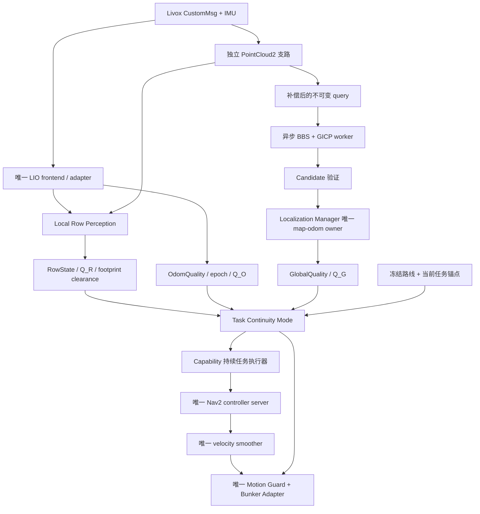

# 温室定位退化下任务连续导航：代码落地方案

日期：2026-10-03。依据：用户提供的论文草案、当前工作区源码和 ROS 2 Humble 的 Nav2 接口。

状态：本文件保留方案制定时的源码审计与实施阶段。核心包、消息、任务/命令契约、异步恢复与研究入口现已实现，实际范围与运行命令见 [代码落地状态](GREENHOUSE_IMPLEMENTATION_STATUS.md)。没有机器人闭环验收结果；当前 V1 验收流程继续按根目录 `AGENTS.md` 执行。

2026-10-03 补充目标：用户希望共用道路中心线算法，支持Bunker、履带式YHS及自研底盘，实车几何/协议稍后补齐。第一版以LiDAR+IMU为主，预留车型几何与测距补盲接口。具体源码缺口、TF和可见性审计见 [多底盘与感知遮挡方案](MULTI_CHASSIS_SENSOR_VISIBILITY_AUDIT.md)。

## 1. 实现目标与范围

实现一个可单独启用的研究模式：可信全局定位曾经确认当前任务和行道；运行中全局定位退化时，若局部行道、短时里程计和实际净空仍满足要求，则继续当前允许区段；后台寻找可信全局位置，恢复后重新接入地图任务。

第一版限定为**固定行道内的短距离连续导航**。局部模式不能凭两条平行边界识别行道编号、纵向绝对位置、地图相机作业点或返航目的地。它必须拥有此前可信定位建立的任务锚点，以及时间、距离和漂移预算。

论文的 `LOCAL` 在实现中统一命名为 `LOCAL_TASK`，避免与已有 local odometry/local costmap 混淆。导航模式与定位测量状态分开：处于 `LOCAL_TASK` 时，仍如实报告全局定位无效。

首个开发交付是 `D_H` 离线行道感知和 `Q_R` 评估；第二个交付是机器人上的只读观测；随后才接入运动权限和恢复。手持数据只能证明传感器相对行道几何的可观测性，机器人闭环性能由 `D_R` 验证。

## 2. 当前源码支持什么、缺什么

| 论文部分 | 当前实现 | 需要完成的工作 |
| --- | --- | --- |
| 原始 LiDAR/IMU、短时 LIO | 单 FAST-LIO2 或 Batch-LIO；canonical odometry；独立 Livox PointCloud2 支路 | 明确点时间、body/base 外参和 odom epoch；提供真实短时可靠性诊断 |
| 冻结几何地图 | Map Registry 的不可变地图版本、PCD 与 BBS assets | 绑定精确版本/hash；附加稳定结构、固定行道、任务路线和实验参数 manifest |
| `z_R` 与 `Q_R` | 没有在线双侧行道联合拟合与质量模块 | 新增独立局部观测器和离线评估入口 |
| `Q_G` | BBS/GICP 门槛、可选 map tracker 的 residual/overlap/innovation | 连续观测、状态过期、退化与候选歧义；校准质量指标 |
| `LOCAL_TASK` | Supervisor、Capability、Guard 均要求有效全局定位 | 新增模式决策与有界运动授权；保持任务外层动作存活 |
| 非阻塞重定位 | ROS wrapper 在回调中同步调用 native subprocess；query 默认停车采集 | 单异步 worker、不可变 query、运动补偿、结果时效/epoch 接受协议 |
| 平滑恢复 | tracker correction 有平滑；重定位结果直接写 current/target correction | 候选验证、恢复插值、机器人当前位姿变化限幅、重新规划与控制交接 |
| 任务连续性 | V1 legacy 任务直连 Nav2；V4 sibling mission 经 capability | 研究模式选择唯一任务入口，新增区段锚点和进度；防止局部终点被记为地图任务完成 |

### 必须修改到真正运行的代码

- 正式 `map -> odom` owner 是 [localization_manager.py](../../navigation/localization/agt_localization_manager/agt_localization_manager/localization_manager.py)。`_on_global_pose()` 按同一时刻计算 correction，但随后直接覆盖 current/target；`_on_relocalize()` 和 `_mark_tracking_lost()` 清除 correction。
- IDE 中的 [agt_localization_core/state_machine.py](../../navigation/localization/agt_localization_core/agt_localization_core/state_machine.py) 目前由 shadow manager 使用。只修改这个纯核心不会改变正式定位节点的行为。
- [global_relocalization.py](../../navigation/localization/agt_global_relocalization/agt_global_relocalization/global_relocalization.py) 的 `_try_start_request()` 同步执行 `run_once()`；`subprocess.run()` 阻塞该节点的回调处理。独立于 LIO 节点不等于完整的异步结果协议。
- [localization.launch.py](../../bringup/agt_system_bringup/launch/localization.launch.py) 默认 `enable_map_tracking=false`。仅依靠初始化成功后的 `LOCALIZED` 状态与持续 odometry，不能观察论文中的持续 `Q_G` 下降。
- [supervisor.py](../../runtime/agt_navigation_supervisor/agt_navigation_supervisor/supervisor.py) 要求新鲜、匹配地图的 `STATE_LOCALIZED`、有效 correction 和全局 TF；[capability.py](../../capability/agt_navigation_capability/agt_navigation_capability/capability.py) 在 health 失效后取消 Nav2并锁存失败。
- [motion_guard_core.cpp](../../platform/agt_base_runtime/src/motion_guard_core.cpp) 中，即便 `allow_degraded_localization=true`，也仍要求 `global_correction_valid=true`。现有开关不能实现全局失效时的局部导航。
- [FollowRoute.action](../../interfaces/agt_navigation_interfaces/action/FollowRoute.action) 只有 Path；当前 capability 要求 `map` frame 并调用全局 `/is_path_valid`，没有行道、任务锚点、odom 路径或连续进度契约。
- 本仓 [mission_runtime.py](../../navigation/nav2/agt_navigation_runtime/agt_navigation_runtime/mission_runtime.py) 直连 `/navigate_to_pose`。相邻 `agt_mission/agt_mission_runtime/agt_mission_runtime/runtime.py` 才走 `/navigation/navigate_to`。现场 inspection 脚本还会启用 legacy runtime；研究入口必须明确动作所有者。

## 3. 推荐的模块结构

保持现有 LIO、定位 manager、Nav2 controller server、velocity smoother、guard 和底盘 adapter 的单一所有权。高频点云计算使用 C++；离线统计、manifest 和实验编排使用 Python/YAML。

```text
perception/agt_local_row_perception/          新增
  include/.../{types,ground_reference,temporal_bev,row_fit,row_quality,clearance}.hpp
  src/{ground_reference,temporal_bev,row_fit,row_quality,clearance}.cpp
  src/local_row_node.cpp
  tools/local_row_offline.cpp
  config/local_row.yaml

runtime/agt_task_continuity/                  新增
  .../{policy_core,task_context,mode_node}    单一导航模式 owner

interfaces/agt_navigation_interfaces/        扩展 typed contracts
navigation/localization/                     扩展 query worker、candidate 接受和恢复
capability/agt_navigation_capability/        扩展持续存活的任务执行器
platform/agt_base_runtime/                   扩展显式局部运动授权
tools/research/                              新增冻结、故障注入、评估入口
```

以上目录是建议落点，创建前确认 workspace 构建与包清单；无需为每个算法步骤创建独立 ROS package。



新 observer 不发布导航 TF、不改变 LIO 输入。后台 matcher 不发布 `map -> odom`。模式节点只决策任务权限，correction 的接受和发布仍由 localization manager 完成。

## 4. 局部行道感知：首批可实现的算法

### 4.1 输入与时间基准

机器人输入取 `/agt/livox/points`，位于 ground/voxel obstacle preprocessing 之前；也可使用已确认 frame 和时间契约的 LIO 去畸变点云。`/agt/navigation/points_obstacles` 已删除地面和部分高度信息，输出只保留 XYZ，不适合恢复论文中的原始支持数、高度层和时序持续性。

该PC2支路在累积前增加按车型与采集时间判断的self分类，保留逐点字段。自体去除与可见性分开：遮挡后方保持unknown，row质量不代替扫掠/停车范围的观测覆盖。

[livox_format_bridge.cpp](../../sensor/agt_livox_tools/src/livox_format_bridge.cpp) 已保留 `timebase/offset_time/timestamp`。回放器同时保存 header time、bag time、逐点时间及单位，明确使用哪一种排序与对齐，不用 pose index 代替秒。

设 `T_OB(t)` 为同一 odom epoch 内的 base pose，`T_BL` 为 LiDAR 到 base 的外参。将点变换到参考时刻 `t_r` 的 body frame：

\[
p_{B_r}=T_{OB}(t_r)^{-1}T_{OB}(t_i)T_{BL}p_L(t_i).
\]

此式输出参考时刻的 `base_link` 坐标，并非 frontend 的 `mapping_body` 坐标。执行位置与姿态插值，拒绝 pose buffer 范围之外的点；随后按重力建立只用于观测的局部水平坐标。逐帧刚体对齐不能消除帧内畸变，两者应分别记录。

机器人按所选 frontend 的 `mapping_body -> base` 契约解析外参，保留 URDF 中 MID360 的安装倾角，避免重复去倾斜。手持数据使用传感器/载体 frame 与相应 IMU 标定，不套 Bunker 的固定外参、self box 或传感器高度。没有可恢复短时轨迹时只运行 A0，A1/A2 的时序实验记 `NOT_RUN`。

### 4.2 地面参照和 BEV

1. 重力约束下鲁棒拟合局部地面，法向归一化并指向上方。使用地面覆盖、残差、法向、跨度和外推距离判断有效性。
2. 论文的 `h=n_g^T p+d_g` 是法向距离；若实现选择垂直 HAG，明确其与法向距离的区别。缺少地面参照的点保持 height-invalid。
3. 在有效地面上构建多高度 BEV。每格保存点支持 `N`、有效高度层数量 `H`、distinct-frame 支持 `P`、占据与观测有效位；支持率分母按具有观测机会的帧定义。
4. 使用按真实时间定义的遗忘系数 `alpha=exp(-delta_t/tau)`。累积前对齐 pose，限制窗口时间/距离；odom epoch 改变时全部清空。
5. 仅对已观测射线/空间更新 free；缺回波不自动判 free。时间持续性用于结构拟合，原始单帧危险障碍另外保留，避免把新出现的障碍当噪声过滤掉。

可借鉴现有 terrain generator 的 ground/elevation/HAG 和 point provenance 小组件，但不能直接搬整条全局融合与 trajectory carve 流水线。手持人员通过的轨迹不能作为 Bunker free-space 证据。

特别注意：[patchwork_adapter.cpp](../../cleaning/agt_terrain_map_generator/src/patchwork_adapter/patchwork_adapter.cpp) 是 cell min-z+tolerance 兼容实现；真正可选的 native Patchwork++ 位于 [patchworkpp_ground_segmenter.cpp](../../cleaning/agt_terrain_map_generator/plugins/ground_segmenters/patchworkpp_ground_segmenter.cpp)。选择哪个实现，需要在论文和 manifest 中准确记录。

### 4.3 两侧共享方向的鲁棒拟合

按照论文使用 `theta=[a,b_L,b_R]`，`y_L=ax+b_L`、`y_R=ax+b_R`。先按多个纵向切片提取两侧候选，RANSAC 初始化，Huber/IRLS 联合优化；权重按 cell/frame 支持设置，避免一个密集帧主导全部拟合。支持行道近似直线的局部窗口；明显转弯、交叉或分叉输出退化原因。

坐标统一为 x 向前、y 向左。设 `b_L>b_R`，`c=(b_L+b_R)/2`、`s=sqrt(1+a*a)`：

\[
w=(b_L-b_R)/s.
\]

论文的 `c/s`、`atan(a)` 表示“目标中心线相对载体”的横向位置与方向。若实现输出“载体相对中心线的跟踪误差”，定义为：

\[
e_y=-c/s,\qquad e_\psi=-\arctan(a).
\]

固定左右关联、正负号和行驶方向，拒绝不明确的 pi 方向解。也可以内部采用共享单位法向的等价参数化，以避免大斜率的不稳定；输出契约保持一致。

仅一侧可见时可以报告单侧距离/方向，但中心与行宽有效位必须关闭，不能靠冻结名义宽度补成双侧观测成功。两侧最少点数、不同帧支持、纵向跨度、最大缺口和拟合残差均单独输出。

### 4.4 参数不确定度与 `Q_R`

在有效、满秩拟合上计算近似 `Sigma_theta=sigma²(JᵀWJ)^-1`，并传播到实际输出：

\[
G=\begin{bmatrix}
ca/s^3 & -1/(2s) & -1/(2s)\\
-1/(1+a^2) & 0 & 0
\end{bmatrix},\qquad
\Sigma_e=G\Sigma_\theta G^T.
\]

该协方差是局部近似；鲁棒权重、重复点与跨帧相关会造成乐观估计，需要用 development 标注或按 frame 的 bootstrap 校准。判定 Hessian 可辨识性时归一化米与角度尺度。

保留 `Q_unc/Q_sup/Q_temp/Q_width` 的原始分项及失败原因。`Q_width` 反映拟合/短时几何一致性，不应仅因当前宽度偏离 `M0` 就判拟合失败；真实冠层变窄由物理通行性判据处理。

按论文加权几何平均计算 `Q_R`；硬条件不满足时明确 `row_valid=false`。未经校准的 `Q_R` 是 quality score，不能作为成功概率；单个高分不能覆盖观测不足或障碍净空未知。

### 4.5 净空与停止距离

拟合出的边界距离与实际 robot clearance 分开保存。`d_L/d_R/d_F` 用真实 robot profile 的 footprint、姿态、车高和短时扫掠空间计算，额外扣除不确定度与 margin；前方没有足够可见长度时不能由延伸直线推断安全。

所需停止距离至少包含：

\[
d_{stop}(v)=|v|T_{delay}+v^2/(2a_{brake})+d_{margin}.
\]

`T_delay/a_brake/margin` 来自真实链路与底盘停止测量。software zero-command 不是 measured stop。观察不到足够净空，或局部 costmap 障碍成立，即进入 SAFE；不能用行道拟合替代实时碰撞检查。

还需独立visibility/clearance gate：当前local costmap未跟踪unknown，而Humble RPP在跟踪unknown时也不会将 `NO_INFORMATION`直接判为碰撞。仅打开unknown配置不构成盲区停车保证；详见 [多底盘审计](MULTI_CHASSIS_SENSOR_VISIBILITY_AUDIT.md)。

## 5. Typed contracts 与模式决策

建议先在 `agt_navigation_interfaces` 增加以下研究接口，保留现有 production 接口语义：

| 契约 | 最少内容 |
| --- | --- |
| `LocalRowState` | reference stamp、frame、odom_epoch、各量 valid mask；`e_y/e_psi/width`、boundary distances、footprint clearances；2×2 error covariance；质量分项、support/coverage、reason |
| `GlobalQuality` | observation/reference stamp、map identity/hash、attempt id；residual/inliers/coverage、归一化不确定度、odom innovation、空间分离候选歧义、valid/reason |
| `OdomQuality` | source stamp/age、epoch、输入与输出连续性、backend诊断可用位、可靠性分项、有限漂移预算；未提供的证据保持 unknown |
| `RelocalizationCandidate` | job id、request/cancel epoch、map id/version/hash、odom epoch、reference/completion stamp、pose、质量原始量 |
| `NavigationMode` | GLOBAL/DEGRADED/LOCAL_TASK/RECOVERING/SAFE；reason、任务/行道/区段 id、anchor、授权 epoch/期限、质量与剩余预算 |
| `RouteSegment` | 固定行道及方向、纵向允许区间、local_allowed、已校验边界/终点、时间/距离/速度预算、是否需要可信地图作业点 |
| 研究任务 action | 原子携带固定 RouteSegment、任务身份、精确地图身份和请求 epoch；反馈模式/进度/剩余预算；内部局部子动作结束不自动产生外层 success |

`NavigationMode` 表示决策；发给 guard 的运动授权必须来自唯一 owner，明确有效期和范围。guard 独立验证关键 source-age/epoch/互锁，不能只信一个 bool。

`Q_O` 不能等同于收到 odometry。AdapterStatus 提供时延与接收诊断，但并不证明 pose 不退化；结合所选 frontend 已有且有明确意义的诊断、时间戳连续性、跳变、局部累计漂移及 wheel 一致性。轮速也有打滑，不单独充当真值。全局匹配与 LIO 共用 LiDAR，需评估它们同时退化的情况。

| 模式 | 允许行为 | 转移条件 |
| --- | --- | --- |
| GLOBAL | 已批准的地图任务、全局规划 | `Q_G` 连续下降/过期进入 DEGRADED；物理或局部关键门失败直接 SAFE |
| DEGRADED | 短暂评估与控制交接；仅在既有授权仍有效时维持命令，否则零输出 | 局部高阈值、可信行道锚点及预算满足后 LOCAL_TASK；不满足则 SAFE |
| LOCAL_TASK | 当前行道内有界 odom 路径；后台 query | 全局候选通过验证后 RECOVERING；局部/odom/净空/预算失效立即 SAFE |
| RECOVERING | 继续合法局部路径，验证并平滑 correction | 当前时刻复核、correction 收敛、全局规划重新有效及交接成功后 GLOBAL；局部门失效 SAFE |
| SAFE | 撤销运动授权并请求零输出；确认 measured stop | 可在明确策略下重新获准；不可凭过期 TF 或单次高分自动继续 |

质量使用高低阈值、最小持续时间和超时；物理硬条件不通过时不等待 hysteresis。LOCAL_TASK 最大时间、沿行距离和漂移预算在 `D_R0` 确定，使用同一 odom epoch 的增量记录，不能由不断滚动的局部窗口重置预算。

## 6. 导航与任务集成

### 6.1 复用现有 local costmap 与 controller server

[costmap.yaml](../../config/costmap.yaml) 的 local costmap 已是 `odom` rolling window，这是局部任务路径的基础。研究 profile 必须使用实时 obstacle layer；现有 `local_obstacle_avoidance=false` 分支会重新引入 static map 依赖，不用于本研究模式。

建议第一版使用 observer 生成有界 odom centerline，交给现有 RPP 的 `FollowPath`；模式层限制速度与距离，保留局部碰撞检查。确实需要直接基于 `e_y/e_psi`、不确定度与 clearance 计算控制时，再在**同一个** controller server 增加 `nav2_core::Controller` 的 `RowFollower` 插件。

Humble `FollowPath` goal 的字段是 `path/controller_id/goal_checker_id`；不要照抄 Rolling 中不同版本的 action 字段。复用 odom Path 的建议来自 Humble 的路径/局部 costmap frame 转换实现，仍需要在当前机器人配置上验证。[Humble FollowPath](https://raw.githubusercontent.com/ros-navigation/navigation2/humble/nav2_msgs/action/FollowPath.action)、[Humble ControllerServer](https://raw.githubusercontent.com/ros-navigation/navigation2/humble/nav2_controller/src/controller_server.cpp)。

local Path 的每个点必须从拟合参考 frame 按对应 reference stamp 转成 odom。旧路径需 TTL/epoch 验证；更新中心线时保持与当前路径段的连续性和曲率约束。不要给 header 改成 `odom` 后直接复用 map 坐标。

### 6.2 持续存活的外层任务

在 capability 增加 `TaskContext`：task UUID、route/point/row/segment、冻结地图身份、trusted global anchor、odom epoch、单调进度和预算。

现有 NavigateTo/FollowRoute 无法携带这组任务语义，应新增明确的研究 action，由 capability 在受理时验证 RouteSegment并创建 trusted anchor。模式节点授予权限，capability 统一执行子动作。接入点是 `_execute/_execute_follow/_watch_health` 和相邻 mission runtime 的导航调用；mission 总超时明确包含局部继续与恢复时间，不在模式切换时重置。

外层任务 action 保持 accepted/executing，内部子动作可以经历 GLOBAL、LOCAL_TASK、RECOVERING。内部模式切换不会自动产生 waypoint success、camera trigger 或 completed_points 增量。路线进度由 owner 维护，不能使用 RViz UI 最近 map waypoint 的进度作为 authority。

局部授权终点冻结于可信 GLOBAL anchor 和同一 odom epoch，并扣除纵向不确定度与停止距离。observer 可以滚动更新几何，但不能不断前移授权终点。局部 FollowPath成功后外层任务仍执行中，转恢复或停车。

首版交接流程：guard 撤销旧授权并立即给零输出 → 请求取消旧子动作 → 确认 terminal → 排空/重置旧命令 → 安装新授权 epoch → 提交新局部子动作。超时、晚接受或状态不明时保持 SAFE，并保留 handle继续取消；可借鉴 [action_execution.py](../../navigation/nav2/agt_navigation_runtime/agt_navigation_runtime/action_execution.py) 的 pending-action 处理。Humble controller 在取消时发布零命令，首版可能产生短暂停顿；这段时间要如实计入论文 `T_stop`。后续若要消除交接停顿，可在同一 FollowPath server 验证 preemption 和路径连续性，不能预先宣称无缝。

运动链保持：

```text
controller /cmd_vel_nav
  -> smoother /cmd_vel
  -> guard /agt/base/cmd_vel
  -> Bunker adapter /mux/cmd_vel
  -> driver / CAN / physical RC arbitration
```

现有 Twist 不包含 task/source epoch，仅新增授权消息不能辨识排队的旧命令。实现时必须在控制器输出端建立 source/epoch 契约，并在 smoother/guard 的交接处保留或验证它；使用带 epoch 的 command envelope，或经过验证的 drain/reset + 终止确认协议。重新贴上“当前 epoch”不能使旧命令变新。

P3 实现时必须选定一条完整方案：command envelope需要扩展 controller 的命令出口与 smoother 的输入/输出；仅添加 RowFollower插件不足以改变标准 controller server发布的裸 Twist。若保持标准消息链，则使用带确认反馈的 smoother reset/drain 和旧动作终止屏障；未确认排空时 guard保持关闭。

新 LOCAL_TASK 权限走现有唯一 guard/adapter 的 50 Hz 链，保留 payload permission、命令超时和物理遥控优先级。guard 已对 stale/blocked 命令立即给零输出，不能把软件限加速度当实际停车证明。研究授权默认关闭；Python rollback backend 未实现同一契约时拒绝启用研究模式。

研究模式只启用一个 mission/capability 入口，关闭或迁移 legacy 直连 Nav2 的客户端。上层 mission 仍保留测停和相机步骤。未知地图位置时到达局部行道末端，不等于到达相机作业点；先恢复可信全局位置再完成原 waypoint。确需研究局部拍摄，需另定义作业契约，明确记录 odom pose 和 global-invalid，不能让存在 TF 等同于地图 pose 可信。

## 7. 全局质量与异步重定位

### 7.1 连续质量监测

首先以隔离的 shadow map tracker 获取 residual、overlap、innovation 等，记录其 attempt/reference time，加入无观测超时。其 pose/status 发布到独立 research topics，正式 manager 不订阅这些输出。当前 `apply_correction=false` 仅关闭 pose发布，status仍可触发正式 manager 清除 correction并恢复，单独使用此参数不构成只读实验。不能把最近一次 `LOCALIZED` 或 covariance 的固定小值作为持续 `Q_G`。

当前候选 backend 只对最高 BBS 候选做 fine refinement；温室重复行道需要保留空间分离的前若干候选，并比较最终一致的质量量，输出歧义。位置很近的重复候选不能充当 second-best 地点。Hessian 做尺度归一化，质量阈值用标注/reference 轨迹校准。

当前 wrapper 按 score 线性映射 covariance，这是经验门槛，不是统计不确定度。实验应同时保存原始量，明确 `Q_G` 质量与实际正确匹配率的关系。

### 7.2 不可变 job 与单 worker

```text
ROS 接收回调：持续维护 cloud/pose buffer、map snapshot 与 epoch
调度器：在 budget 内 freeze Job，至多一个在途请求
worker：使用 Job.query、Job.assets 运行 native matcher，返回纯结果
ROS 完成回调：核验 Job 身份/时效/质量，送 manager 接受
```

Job 冻结 query points、reference stamp、同一时刻 `T_OB`、map id/version/hash、odom epoch、request/cancel epoch、deadline。worker 不读取可变 `self.clouds[-1]`；当前结果 stamp 的该写法在异步改造后必须替换。

限制 native threads、超时、重试频率与单次点数，使 LIO、local observer 和 guard 的时延保持在已测预算内。取消能终止或隔离 worker；结果仍按取消 epoch 丢弃。

manager 在接受前拒绝非有限值、未来/过期时间、乱序结果、旧地图、旧 odom epoch、已取消请求和歧义候选，再按**同一参考时刻**计算：

\[
C_{new}=T_{MB}(t_r)T_{OB}(t_r)^{-1}.
\]

结果完成时已运动，历史 pose 不能当作当前 pose；用 `C_new*T_OB(now)` 与最新局部结构/稳定地图做独立时效和一致性复核。当前 tracker 在没有有效 global correction 时不工作，需要新增 candidate verification 路径；不能等待一个被 gate 关闭的 tracker 自行恢复。

最新点云匹配与双侧行道几何本身仍可能在错误的重复行道上通过。地点接受还要符合可信任务锚点及累计漂移界，或有辨识力的稳定结构证据；若多个行道仍无法区分，则保持候选未接受，局部预算耗尽时 SAFE。

固定地图模式也必须传递并核验 identity/hash：当前 `follow_map_manager=false` 路径的 wrapper snapshot 不能提供完整结果身份。experiment loader 必须保证实际使用的 assets 与 Job 的冻结地图一致。

### 7.3 运动 query

先完成 stationary worker 的异步化，再新增 moving query。当前 wrapper 只读取 XYZ/intensity，对多帧做固定外参转换后拼接；把 `require_stationary` 关闭会混入运动误差。

moving query 必须逐点去畸变或使用已确认的 frontend deskew cloud，再把多帧变换到一个 reference frame。query 是 `mapping_body` 还是 `base_link` 要显式声明并按既有 calibration 转换。RTK仍为记录/质量元数据，不参与种子或 correction。

## 8. 平滑恢复

全局无效时保存绑定 odom epoch 的 `last_trusted_correction` 供历史锚点和 recovery 起点使用；它与“当前 global-valid”分开。odom reset时废弃旧 correction、任务锚点和插值起点，进入 SAFE，不跨 epoch平滑。不得通过不断刷新旧 TF 获得 navigation-ready。

可信候选通过验证后，manager 进入 RECOVERING：

\[
C(t)=C_{old}\exp\{\alpha\log(C_{old}^{-1}C_{new})\},\quad
\alpha=3\tau^2-2\tau^3.
\]

其中 `tau=clamp((t-t_start)/T_R,0,1)`，`T_R>0`，起点和目标在启动恢复时冻结。

该公式可使用 SE(3)，或在符合现有 frame 契约的平面场景中明确采用 SE(2)。它只描述插值曲线，不能自动保证错误候选正确或控制命令平稳。

RECOVERING 继续合法 odom 局部控制；插值中的地图 pose 不作为新的全局任务到点判据。限制 `C(t)*T_OB(now)` 引起的**机器人当前地图位置/航向变化**。只限制 correction 原点的平移速度不够：机器人远离 odom 原点时，小角速度也会产生很大的地图位置变化。

修正限幅在同一个 `T_OB(now)` 上比较更新前后的 correction，仅约束修正造成的位姿增量，避免把真实行驶位移混入修正限速。

候选差异过大、区段身份不一致或局部安全预算不足时停止并重新确认。完成恢复要求：最新全局观测连续通过、correction 剩余量满足阈值、从当前已校正 pose 重新规划、旧局部命令被撤销且新命令交接确认。仅时间 `T_R` 到达不算恢复成功。

ROS 的 `odom` 是连续短时参考、`map` 允许定位修正；这一划分支持在恢复期间保留局部控制参考。全局 TF 仍由唯一 localization owner 发布。[REP-105 原文](https://raw.githubusercontent.com/ros-infrastructure/rep/master/rep-0105.rst)。

## 9. 冻结实验 bundle 与数据

在 `D_R0` 构建 `M0`，用 research manifest 引用现有不可变 map package；稳定结构、行道、路线等附加资产在发布前校验并逐项 hash。无需重新引入已退役的 MapManager 地图生成 CLI。

建议 bundle：

```text
M0_experiment/
  manifest.yaml        精确 map/version/hash、依赖资产、软件/参数/标定身份
  stable_mask.*        人工核验的长期稳定结构
  corridors.yaml      固定 nominal centerline、入口/出口、方向和区段
  routes.yaml         R1/R2/R3、任务点及 local_allowed 区段
  parameters.lock.yaml
  calibration.lock.yaml
```

字段最少包括 experiment/session/data role、map/route/calibration/parameter hashes、各 workspace repo commit、dirty flag/patch hash、LIO backend、时钟约定和评估 reference 来源。正式实验尽量使用干净固定 commit；dirty workspace 仅记一个 commit 不足以复现。

实验加载精确版本，hash 不符就拒绝启动；不能使用以后会解析到新 `latest_validated` 的 `map:=auto`。`D_R1` 开始锁定感知、质量、模式、安全、控制与恢复参数；修改算法或参数需新实验版本，不能按生长阶段分别调优后仍作同一组。

`CIR/O_map` 应在独立 offline reference 对齐下计算，不能在全局定位失败时，用正在被评估的 online pose 自己充当空间评估真值。非地面点包括立柱、设备与人员；没有植被标签时称“非地面侵入比例”，不能直接声称 canopy CIR。`M_stable` 如果进入 matcher，所有对照组使用相同资产，或者单独设置 stable-mask 消融。

记录 raw LiDAR/IMU、header/bag/point times、local odometry 与 epoch、map correction、global candidates/quality、row state/path/quality、任务/模式/授权变更与 reason、global/local plan、action lifecycle、上游 cmd、guard/adapter cmd、wheel measured velocity、payload/RC诊断与 map/calibration manifest。图像继续用 C1 时间关联；所有 offline reference 标记来源与不确定度。

## 10. 实施顺序与验收交付

每个阶段单独完成、记录证据再进入下一阶段。表中的验收是未来开发需要取得的证据，本次源码审计没有运行它们。

| 阶段 | 可提交的代码与产物 | 进入下一阶段的条件 |
| --- | --- | --- |
| P0：`D_H` 离线观测 | 独立 C++ row core、共享 offline CLI、A0/A1/A2、逐窗口 CSV/BEV/拟合图、manifest | 标注集上 `e_y/e_psi/w` 误差、双侧有效率、单侧/短跨度退化、运行时延；无轨迹时明确不运行时序实验 |
| P1：`D_R0` 冻结与 shadow | 固定安装/calibration、M0 bundle、只读 `Q_G/Q_R/Q_O` 与模式影子日志 | 数据完整；从可信 GLOBAL anchor 到局部区段的对应关系可复核；参数与真实刹停证据确定 |
| P2：模式核心与契约 | pure policy core、typed messages、任务上下文/预算、过期与 epoch 判据 | 回放/模拟覆盖状态转移、时间乱序、odom reset、单侧观测、未知净空、预算耗尽，默认 V1 行为保持 |
| P3：有界局部执行 | 唯一 capability 子动作 owner、odom FollowPath、command ownership、研究 guard gate | 仿真/封闭环境确认旧动作/命令不泄漏、任何关键门失败停车、局部终点不触发地图任务完成 |
| P4：后台重定位与恢复 | stationary async → moving deskew query、candidate protocol、manager recovery、重新规划 | 长耗时/取消/旧地图/旧 epoch/错误行候选被正确处理；LIO/observer/50 Hz command chain 时延有记录；恢复冲击可测 |
| P5：长期机器人实验 | B1/B2/Proposed、R1/R2/R3、`D_R1+`、C0–C5、自动评估报告 | 同地图/路线/参数/硬件记录，失败和物理不可行的 run 均保存；闭环结论来自真实机器人数据 |

首批 P0 core 可采用以下边界，避免离线和在线出现两套算法：

```cpp
// 建议 API，尚未实现。
AlignedWindow alignWindow(const TimedClouds&, const PoseBuffer&, const FrameContract&);
GroundReference estimateGround(const AlignedWindow&, const GroundConfig&);
BevEvidence buildBev(const AlignedWindow&, const GroundReference&, const BevConfig&);
RowFit fitParallelRows(const BevEvidence&, const FitConfig&);
RowQuality evaluateRow(const RowFit&, const BevEvidence&, const QualityConfig&);
Clearance evaluateClearance(const AlignedWindow&, const RobotEnvelope&, const MotionBudget&);
LocalRowResult observe(const ObservationInput&, const LocalRowConfig&);
```

拟定 offline CLI 输入为 bag/topic、dataset role、frame/calibration、参数文件、随机 seed 和 output dir，输出 `row_states.csv/diagnostics.jsonl/bev/fit_overlays/manifest.yaml`。离线工具不接底盘，ROS observer 只发布观测和诊断。具体 CLI 名称在 P0 实现时确定。

## 11. 实验定义需要补充的边界

- **C1：没有初始全局定位。** 无可信 anchor 时，两侧平行结构不能识别固定地图任务。默认 SAFE。若设计独立“已知入口/人工确认行道”的局部任务实验，明确额外输入与可验证的相对终点，单列结果。
- **C2：中途失定位。** 从可信锚点进入已批准区段，验证有限 LOCAL_TASK、后台恢复和任务外层持续性；这是第一版的主要实机场景。
- **C3：错误全局定位。** 在模拟/隔离测试入口注入，验证创新、候选歧义和独立一致性判据。实机不直接发布任意 TF；可信-looking 的错误定位也必须被评估。
- **C4：恢复。** 使用同样的候选与参数比较 hard switch / smooth recovery；分别记录控制器切换停顿、插值时间和整体任务时间。
- **C5：全局和局部同时退化。** 同时覆盖 LiDAR/LIO 退化、局部证据失效和净空不足；验证立即撤权、zero output及 measured stop。

B1/B2/Proposed 共享 map、传感器、基础控制器与质量判据，仅改变允许的退化策略。Odom-only 消融优先离线/仿真，实机仍保留碰撞、预算和停车门。

任务完成率统计所有尝试的 run；物理不可行、算法失败、操作中止和传感器失败分别给出原因，并另报可行场景子集结果。定位停车时间由 reason、实际速度和任务阶段联合定义，避免把相机作业停车算作定位停车。

手持标注与 robot reference 都明确来源。中心线误差计算使用独立 reference，不用 observer 自己拟合出的中心线当真值。沿日期、采集段/行道划分 development/test，避免相邻帧同时进入调参与测试。每个生长阶段保留相同机位照片、环境指标、重复 runs 和置信区间。

## 12. 本方案的首个执行目标

先完成 **P0：离线局部行道观测器**，产出一张可复核的 timeline：`e_y/e_psi/w`、双侧有效位、`Q_R` 分项和退化原因，与标注叠加。取得机器人 `D_R0` 后再加入同一时间轴的 `Q_G/Q_O`。

由此检查论文关键假设：是否实际存在“全局匹配不可靠、局部两侧仍可辨识且真实通行条件满足”的时间段。该证据成立后，P2–P4 的模式、控制与恢复改造才有明确的参数来源和实验价值。
