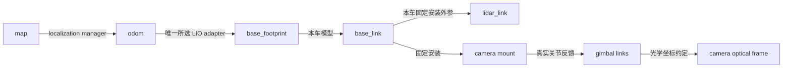

# 道路中心线导航：多履带底盘、车辆 TF 与感知遮挡审计

日期：2026-10-03。

用户目标：共用导航与局部道路中心线算法，支持 Bunker、用户已确认的履带式 YHS 及自研底盘。实车尺寸、协议、安装照片/CAD 后续补充，本阶段先明确代码边界和待补配置，不填造物理参数。

状态：下文保留实施前的源码审计。通用履带接口、按车型选择 TF/Nav2、自体过滤与可见性 core 已加入代码，实际接线与待标定项见 [代码落地状态](GREENHOUSE_IMPLEMENTATION_STATUS.md)。未启动硬件、未运行机器人或软件测试。

## 1. 相机是否必要

**第一版道路中心线研究以 MID360 + 内置 IMU为主。** 3D 点云能作为双侧边界、方向、中心线、行宽与可见障碍的输入；是否达到可控制的观测质量，需要离线标注及固定安装机器人数据验证。

相机按用途分开：

| 用途 | 当前建议 | 必须具备的条件 |
| --- | --- | --- |
| 环境照片、巡检记录 | 保留已有 C1；可另外录连续 RGB | 图像时间与现场位置/阶段记录 |
| 植被 CIR 标签、类别与行号标识 | 可选离线标注或后续语义分支 | 标签/reference；在线时还需内参、外参、时间与关联质量 |
| 近场测距、低矮障碍补盲 | 仅在覆盖审计证明有必要后新增 | 真实有效深度或其他测距、独立视角、完整标定与新鲜度判据 |
| 视觉里程计/视觉重定位 | 后续独立研究版本 | 连续图像、可验证的视觉质量与退化逻辑，新增实验对照 |

当前 C1 链是 `usb_cam` RGB → 云台 acquire-view → 新鲜图像记录，不是已经集成的深度导航输入。其默认 `camera_info_url` 为空，未查到完整 `base -> gimbal -> camera_optical` TF 或真实云台角度到 JointState/TF 的发布者。

相关源码：[C1 launch](/home/yangxuan/ros2_ws/src/drivers/Autolabor-C1-ROS2/src/autolabor_c1_bringup/launch/autolabor_c1.launch.py:24)、[capture service](../../sensor/agt_capability_camera/agt_capability_camera/camera_capture_service.py:41)。YHS whole-robot 配置里的 Orbbec TOF用于机械臂采摘，由 picker通过 SDK使用，不能当作现有连续导航深度话题。

普通 RGB 不能直接提供有依据的米制净空；装在同一被遮挡位置的相机也没有额外可见空间。若后续加相机补盲，优先固定导航视角；使用转动云台时需要按实际反馈角和采集时间计算动态外参。

MID360 官方规格为水平 360°、垂直 −7°～52°、近处盲区 0.1 m；官方也指出近距离低反射率/细小目标可能检测不可靠。因此，360° 水平视场不能证明低位近场或车体影区已覆盖。[Livox 官方规格](https://www.livoxtech.com/cn/mid-360/specs)。

主论文各组保持相同传感器条件；加相机的收益单列消融，避免将感知硬件变化的收益都归因于任务模式。

## 2. 多底盘支持的实际状态

| 车型 | 当前源码状态 | 面向用户目标的修改 |
| --- | --- | --- |
| Bunker | 已有 driver、C++ adapter、Robot Profile、URDF、Nav2配置选择 | 作为当前基线；补齐物理几何与统一感知模型 |
| YHS 履带 | sibling中已有 ROS 2 driver和命令桥；正式 hardware/nav/adapter选择仍 blocked | 目标使用 `skid_steer`；补本车 profile/模型/标定、真实协议、反馈归一化与导航注册 |
| 自研底盘 | 未注册 driver adapter或独立 profile | 若也是履带/差速，复用相同平面导航模型；按实际协议实现 adapter；其他运动学另选策略 |

用户已确认这台 YHS 是履带式，设计不再按品牌推测 Ackermann。旧审计的 blocked 状态仍反映当前代码，但解除运行拦截还需要核对具体控制字段、单位、gear、超时与停止语义。

当前缺口：

- [base_adapter.hpp](../../platform/agt_base_runtime/include/agt_base_runtime/base_adapter.hpp:11) 已提供运动学类型和通用转换接口，是可复用边界。
- [navigation.launch.py](../../bringup/agt_system_bringup/launch/navigation.launch.py:293) 只对 Bunker特例接受 skid-steer；非 Bunker当前仅有 Ackermann校验。给自研履带新 YAML仍会被拒绝，需要真正通用的 tracked validator。
- 同文件 `base_adapter_node_spec()` 仅启用 Bunker；[base_adapter.launch.py](../../platform/agt_base_runtime/launch/base_adapter.launch.py:11) 也只有 Bunker选项。
- sibling [robot_config.py](/home/yangxuan/ros2_ws/src/agt_robot_platform/agt_robot_bringup/tools/robot_config.py:35) 的注册与 hardware组件需要扩展。模型 launch目前也仅允许 `bunker_v1`。
- YHS旧桥从 `/mux/cmd_vel` 读命令；正式 adapter应统一从 `/agt/base/cmd_vel` 接入，不能产生第二个绕过 guard的命令链。详见 [YHS协议审计](../upgrade/YHS_BASE_PROTOCOL_AUDIT.md)。

### 公共接口与每车配置

```text
公共导航 / 中心线控制
  -> 唯一 smoother + guard
  -> /agt/base/cmd_vel
  -> 当前车型唯一 adapter
  -> 当前车型 driver / CAN

driver真实反馈
  -> 车型 adapter归一化
  -> base odometry / measured twist / typed base state
```

共享算法代码，每车独立维护以下配置：

- **运动学与协议**：平面 `v_x/omega_z`、单位与正负号、原地转向能力、倒车、控制频率、命令/反馈超时、遥控/急停/故障语义。
- **车辆几何**：运动参考点、车体高度、履带与突出件、驾驶状态载荷包络、footprint及独立self几何。
- **运动限制**：实测速度、加减速、延迟与制动距离；不同车辆不能直接复制 Bunker数值。
- **传感器安装**：本车 LiDAR/相机/机构外参、时间来源和可见性模型。
- **导航参数**：与本车footprint和限制匹配的 Nav2与感知配置；按运动学选择公共策略。

自研底盘若只接左右履带速度，可从 `v_R=v+omega*B_eff/2`、`v_L=v-omega*B_eff/2` 的名义模型开始，`B_eff`需考虑实车转弯与滑移校准；已有 driver接收标准 `v/omega` 时由其完成底层转换。反馈必须来自真实测量，不能把目标速度充当实际速度。

里程计归一化还包含 frame、时间、位姿/速度参考点与协方差。参考点改变会影响转弯时的线速度，不能仅更改 `frame_id`。履带打滑时降低其一致性证据权重。

## 3. 车辆 TF应按什么方式维护



当前 static/body模型由唯一 robot_state_publisher发布。driver继续关闭导航 odom TF，禁止每车额外发布一条竞争 `odom -> base_link`。

建议在 sibling `agt_robot_description` 中新增独立车型模型/profile/calibration，由 profile引用正确文件；默认calibration路径也按车型解析，不能所有车型继续指向 Bunker `field_acceptance.yaml`。

注意两个不同外参：

1. MID360内部 LiDAR与IMU关系属于选定 LIO frontend标定。
2. MID360固定到车体的外参属于本车模型。

换车或重新安装主要修改第二项并复核整条 body/base转换，不靠更改 frontend参数符号补偿车辆 TF错误。已有 FAST-LIO adapter会组合 internal body-to-lidar与车辆 lidar-to-base关系。

当前 Bunker [field_acceptance.yaml](/home/yangxuan/ros2_ws/src/agt_robot_description/config/field_acceptance.yaml:4) 验收范围仅 `stationary_relocalization`。其已有雷达倾角应保留为当前基线，不能据此宣称完整闭环覆盖已验收。Bunker profile中的 `width/length` 仍为 null，现有footprint也不能代替所有真实三维尺寸。

同一场地三维地图可以按兼容性复用；地形通行投影、footprint和任务净空需要符合各车型。现有地图包还受 `robot_profile`兼容检查约束，增加车型时需同步处理该契约。

## 4. 自反射与真实遮挡的解决方案

### 4.1 已发现的具体配置不一致

[perception.yaml](../../config/perception.yaml:14) 当前只有单个Bunker self box：

```yaml
center_xyz: [0.0, 0.0, 0.20]
size_xyz: [1.023, 0.778, 0.400]
padding_m: 0.05
```

URDF使用的 `collision_proxy` 同尺寸但 origin为 `[0,0,0]`，两者都相对 `base_link`，z中心差0.20 m。URDF箱体z范围 `[-0.20,0.20]`；当前self mask加padding后的z范围 `[-0.05,0.45]`。

这是几何配置契约不一致，可能造成底部自回波漏删、上方环境点多删。它不能证明哪个值符合实物；实车资料后补时统一核实。代码侧应让 URDF、self几何和visibility引用同一份车型几何，避免以后维护两套坐标。

底盘visual CAD、Nav2 footprint、self过滤几何和ray遮挡几何用途不同。footprint包含安全余量，不能直接当self box，否则会删除车外真实障碍。支架、桅杆、机构与载荷需要单独的简化box/cylinder等几何。

### 4.2 共享的感知支路

```text
/livox/lidar (CustomMsg) -----------------> 原始 LIO，保留逐点时间
       |
       +-- bridge --> /agt/livox/points
                         |
                         +-- timestamped self geometry classification
                               +-- 去畸变/短时累积 --> 行道BEV/centerline/Q_R
                               +-- ground/voxel --> Nav2障碍marking
                               +-- query预处理 --> BBS/GICP/map tracker
                               +-- 原始ray与遮挡分类 --> visibility/clearing
```

现有 self过滤只用于Nav2障碍支路；BBS/GICP与map tracker仍读未self过滤的PC2。建议新增共享的车体分类/过滤核心，输出保留全部原字段、时间和frame的感知点云，分别供各用途使用。

自体判断按点采集时刻的 sensor-to-body与机构姿态进行，再做多帧累积；不能把历史自体点搬到当前frame后，用当前箱体判断。静态车型先使用固定几何；动态机构需要实际joint反馈。没有关节几何时使用明确的驾驶状态保守包络，并记录由此产生的盲区。

现有 obstacle输出只保留XYZ，不用作 row输入或 moving query输入。新 self处理也不插入原始 `/livox/lidar -> LIO` 支路。

### 4.3 被遮挡的空间仍保持未知

建议单独发布研究 `VisibilityState/Grid`，至少区分：

```text
robot body / occluded by robot / outside FOV / unobserved
observed free / occupied / stale observation
```

模型FOV/raycast表达“理论上可见”；真实、带时间戳的ray/点证据表达“这次确有观测”。Livox返回点不能直接代表每条发射射线信息；无回波或没有采样机会的格子不能自动设free。

删除车体回波不会恢复后方数据。clearing保留各传感器真实origin，射线遇到自身opaque几何即停止；也不能跨过已经观测到的障碍，清除其后空间。多传感器marking可融合，但clearing按各自origin/时间分别处理。Humble默认用cloud.frame作为origin，另可指定sensor_frame；全部cloud转base坐标后，不能因此把base原点当所有传感器原点。[Humble ObservationBuffer](https://raw.githubusercontent.com/ros-navigation/navigation2/humble/nav2_costmap_2d/src/observation_buffer.cpp)。

### 4.4 中心线质量和行驶范围覆盖分开判定

道路中心线模块可以用中高侧边结构估计横向与航向，近低位障碍模块检查当前车辆扫掠体。中心线高质量不能覆盖前方净空 unknown。

当前 local costmap未设置 `track_unknown_space`，Humble默认false。即便打开，该版本RPP的 `inCollision()` 对跟踪unknown时的 `NO_INFORMATION`也返回非碰撞。**仅改costmap unknown参数不能保证盲区停车。** 需新增独立visibility/clearance gate，或明确实现并验证unknown collision policy。[Humble Costmap2DROS](https://raw.githubusercontent.com/ros-navigation/navigation2/humble/nav2_costmap_2d/src/costmap_2d_ros.cpp)、[Humble RPP](https://raw.githubusercontent.com/ros-navigation/navigation2/humble/nav2_regulated_pure_pursuit_controller/src/regulated_pure_pursuit_controller.cpp)。

运动权限同时要求 row_valid、odom可靠以及实际扫掠/停车范围coverage满足要求。速度上限由已观测的连续净空、真实制动延迟/距离和余量确定；净空无法证明时停止。倒车、原地旋转也按对应扫掠体检查，不能只审计车前方。

当前标定推算雷达离平地约0.9275m、前向俯角约13°。理想平地射线估算前向最低beam约−20°，地面首次交点距雷达约2.55m；后向最低beam约+6°。这是模型推算，并非已测障碍探测距离，但足以说明“车边地面有缺点”未必只由车体遮挡造成。升高雷达可能扩大低位盲区，安装方案需结合整圈FOV与实测，而非统一加高。

永久影区若位于必需的行驶/停车范围，调整安装或加入能看到该区的近场测距视角；短时累积只能利用同一位置此前的真实观测，不能无限延长其有效期或用于保证新出现的动态障碍不存在。

## 5. 后续执行顺序

1. **道路中心线离线core**：沿原实施方案P0，加入time-preserving self接口、per-profile geometry引用和ground/row有效位。
2. **可见性诊断**：将理论遮挡mask和实际coverage分别显示，输出两侧支持、near-field覆盖、unknown原因与age；在已有Bunker模型上先检查配置一致性。
3. **通用tracked配置选择**：为Bunker/YHS/自研履带共用校验逻辑，profile/driver/geometry分别注册；未知物理值保持待补，不把空模板当可运行profile。
4. **实车资料补齐后**：逐车更新模型与TF、协议和反馈、制动与coverage证据，确认是否需要额外近场传感器。
5. **控制接入**：中心线+有界任务上下文通过唯一控制链执行；局部观测质量与扫掠coverage共同决定运动权限。

与 [论文落地方案](GREENHOUSE_TASK_CONTINUITY_IMPLEMENTATION.md) 的关系：中心线感知仍是首个开发目标，self/visibility是输入有效性与控制资格的一部分；相机融合与多车型现场启用分别作为后续有明确数据依据的阶段。
